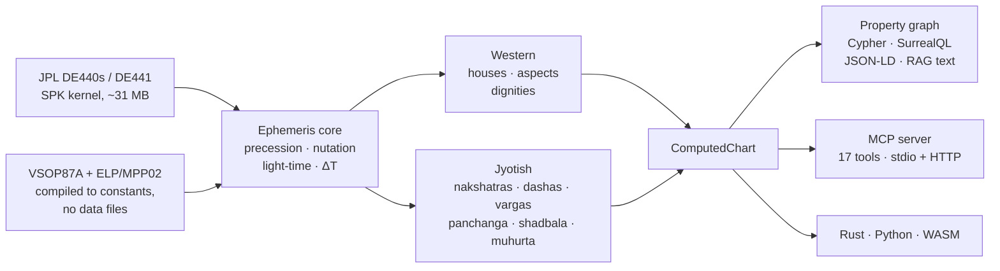

# Vedaksha — Vision from Vedas

**Clean-room Rust ephemeris and Vedic astrology engine, built for the agentic-AI era.** Sub-arcsecond planetary precision, every algorithm traced to a primary source, any chart queryable as a property graph.

[](https://crates.io/crates/vedaksha)
[](https://docs.rs/vedaksha)
[](https://pypi.org/project/vedaksha/)
[](https://www.npmjs.com/package/vedaksha-wasm)
[](https://github.com/arthiqlabs/vedaksha/actions/workflows/ci.yml)
[](Cargo.toml)
[](LICENSE)

[Website](https://vedaksha.net) · [Docs](https://vedaksha.net/docs) · [Playground](https://vedaksha.net/playground) · [API reference](https://docs.rs/vedaksha) · [Blog](https://vedaksha.net/blog)

`clean-room` · `0.103″ vs JPL Horizons` · `1,069 tests + 24,350 oracle rows` · `MCP-native` · `BUSL-1.1 → Apache 2.0`

[Install](#install) · [Quick start](#quick-start) · [Accuracy](#accuracy) · [What's inside](#whats-inside) · [MCP + property graph](#mcp--property-graph) · [Provenance](#clean-room-provenance) · [License](#license)

---

## Install

| Platform | Install | Notes |
|----------|---------|-------|
| Rust | `cargo add vedaksha` | full pipeline |
| Python | `pip install vedaksha` | engine via WebAssembly, `py3-none-any`, Python ≥ 3.9 — no Rust toolchain |
| WASM | `npm install vedaksha-wasm` | browser & edge, no data files |
| MCP | `cargo install vedaksha-mcp` | stdio + HTTP (bearer auth) |
| Docker | `docker run -e VEDAKSHA_MCP_TOKEN=… -p 3100:3100 ghcr.io/arthiqlabs/vedaksha-mcp` | multi-arch (amd64 + arm64) |

Compute **janam kundali** (natal charts), **panchanga**, **dashas**, **nakshatras**, **vargas**, **shadbala**, **ashtakavarga**, **muhurta** and **transits/gochara** from a sub-arcsecond ephemeris (VSOP87A, ELP/MPP02, JPL DE440s/DE441).



## Quick start

```python
from vedaksha import Vedaksha

vk = Vedaksha()
chart = vk.natal_chart(julian_day=2451545.0, latitude=28.6139, longitude=77.2090)
```

```bash
cargo install vedaksha-mcp && vedaksha-mcp     # stdio: Claude Desktop, Cursor, VS Code
```

The Rust path is a compiled doctest in [`crates/vedaksha/src/lib.rs`](crates/vedaksha/src/lib.rs).

**Every Julian Day on the public surfaces is UT1**, not TT and not TDB. The engine converts to TT internally for the dynamical terms and uses UT1 for Earth rotation, which fixes the ascendant, MC and all twelve cusps. Passing a TDB Julian Day adds ΔT worth of rotation instead of removing it — 0.289° (17.3′) at today's ΔT ≈ 69 s, on every cusp. The one exception is the raw SPK query (`state_vector`), which indexes the kernel directly and takes TDB.

## Accuracy

Every figure is printed by a named test. Reproduce the ephemeris tables with `bash scripts/download_de440s.sh`, then `cargo test -p vedaksha-ephem-core --release -- --include-ignored --nocapture`; the ayanamsha figures come from `cargo test -p vedaksha-astro sidereal`, and the cross-check against an independent Python derivation of the same primaries from `cargo test -p vedaksha-astro --test ayanamsha_fixture`.

**SpkReader vs JPL Horizons (DE441)** — `oracle_comparison.rs`, 24,350 committed rows (10 bodies × 2,435 dates, 1900–2100). Horizons serves DE441, so this measures our DE440s pipeline against an independent kernel.

| Era | Comparisons | Mean | Max |
|-----|-------------|------|-----|
| 1900–2025 (ΔT measured) | 15,350 | **0.103″** | 1.187″ (Uranus) |
| 1900–2100 (all) | 24,350 | 0.878″ | 44.912″ (Moon, 2099) |

15,349 of 15,350 comparisons before 2026 are sub-arcsecond. **Past 2025 the residual is ΔT prediction, not ephemeris error:** our Espenak–Meeus extrapolation and Horizons' ΔT diverge by ~68 s at 2099, and the error scales with a body's angular rate — the Moon (0.64″/s) picks up ~45″, Pluto essentially none. At 2099-02-06, five bodies spanning 0.03–0.64″/s all imply the same 66–71 s offset, which is the signature of a clock difference, not a position error.

**AnalyticalProvider vs JPL Horizons** — `analytical_oracle.rs`, 1900–2025: overall mean **0.239″**, worst case **1.896″** (Neptune), Moon 0.169″ mean via ELP/MPP02. Densely sampled at 2,435 dates per body.

Until 2026-08-20 those figures were 2.06″ mean and 24.22″ worst, and this README attributed the gap to VSOP87A being a truncated theory. That was wrong, and the wording protected a defect of ours: the analytical provider answered `EarthMoonBarycenter` with VSOP87A's Earth-centre series, so the observer sat 4,671 km off, and `earth_state` divided a barycentre-relative Moon by `1 + EMRAT` instead of `EMRAT` for a further 56.8 km. Both are fixed. The second one moved the SPK path too, 0.106″ → 0.103″.

**ELP/MPP02 Moon** — `lunar_horizons.rs`: **0.015″ at J2000**, 0.020–0.053″ across 1500–2500 CE.

### What is *not* measured

- **House cusps are not validated against any external reference.**
- **No ayanamsha is validated against another implementation, and that is deliberate.** All eleven are derived forward from a primary — a chapter, a committee, a proposer's own paper, or a star catalogue — and each reproduces its own anchor to 1e-9° and, where its primary documents one, its own zero year. What is *not* claimed is agreement with anyone else's numbers: comparing against them would be the reverse-engineering this re-derivation exists to undo. See [`docs/audit/2026-08-17-ayanamsha-cleanroom/`](docs/audit/2026-08-17-ayanamsha-cleanroom/).
- **Dasha and nakshatra tests are invariant tests**, not external comparisons: they verify that BPHS constants sum to 120 years and that boundaries tile the circle.

## What's inside

**Two ephemeris providers.** `SpkReader` reads JPL DE440s (~31 MB) for sub-arcsecond work. `AnalyticalProvider` compiles VSOP87A + ELP/MPP02 to constants and needs no data files — for WASM, edge and Cloudflare Workers.

**Jyotish, from primary sources.** 27 nakshatras with padas and lords · 5 dasha systems (Vimshottari, Yogini, Ashtottari, and Jaimini's Chara & Narayana) · all 16 vargas (D-1 → D-60) · six-component shadbala with Ishta/Kashta phala · 11 ayanamshas, each traceable to a chapter, a star or a committee · panchanga's five limbs, with vara reckoned from local sunrise and Rahu/Gulika Kalam as real time windows · graded drishti per BPHS Ch. 26 · mean, true and osculating nodes, all referred to the ecliptic of date, with the J2000 variant tracking DE441's `OM` to 0.6″ (KP sub-lord ready).

**Western: calculation, not interpretation.** 10 house systems, major aspects with applying/separating motion, essential dignities, synastry and composite. `ChartConfig` defaults to tropical. There is no Western interpretive layer and no parity with the Jyotish surface.

**Crates**, published to crates.io in lockstep: [`vedaksha`](crates/vedaksha) (umbrella, 7 locales) · [`-math`](crates/vedaksha-math) · [`-ephem-core`](crates/vedaksha-ephem-core) · [`-astro`](crates/vedaksha-astro) · [`-vedic`](crates/vedaksha-vedic) · [`-graph`](crates/vedaksha-graph) · [`-mcp`](crates/vedaksha-mcp).

## MCP + property graph

17 tools, discoverable with a single `tools/list`. The catalog is generated from the Rust definitions and locked by a snapshot test, so it cannot silently drift from the code.

`compute_natal_chart` · `compute_dasha` · `compute_vargas` · `compute_karakas` · `compute_combustion` · `compute_shadbala` · `compute_ashtakavarga` · `compute_transit` · `compute_gochara` · `search_transits` · `search_muhurta` · `compute_panchanga` · `compute_drishti` · `compute_bhavas` · `compute_synastry` · `compute_composite` · `emit_graph`

Any chart converts to a property graph via `emit_graph` or `vedaksha_graph::chart_to_graph`, emitting Cypher, SurrealQL, JSON-LD, JSON or RAG embedding text. An agent can then ask "which planets aspect the 7th-house lord?" as a graph query instead of re-implementing chart logic. Computations themselves return typed structs; the graph is a projection you ask for.

**What a chart actually yields:** 4 of the ontology's 9 node types (`Chart`, `Planet`, `Sign`, `House`) and 7 of its 12 edge types. `Nakshatra`, `Pada`, `Pattern`, `DashaPeriod` and `FixedStar` are defined in `vedaksha_graph::ontology` but are not built from a `ComputedChart`, which does not carry the data they need. Compute those through their own APIs.

```bash
VEDAKSHA_MCP_TOKEN=… vedaksha-mcp --http --port 3100
```

HTTP mode requires `Authorization: Bearer <token>` on every POST and refuses to start without `VEDAKSHA_MCP_TOKEN`, unless you pass `--insecure-no-auth` for a trusted network. `/health` and the informational `GET` stay open.

## Clean-room provenance

Every implemented algorithm carries a `// Source:` doc-comment naming its primary paper or treatise — VSOP87A, ELP/MPP02, IAU standards, BPHS, Jaimini. Two subsystems have been re-derived from primary sources behind a documented firewall, and each ships its own audit directory: the lunar theory ([2026-05-09](docs/audit/2026-05-09-elp-mpp02-cleanroom/)) and the sidereal surface ([2026-08-17](docs/audit/2026-08-17-ayanamsha-cleanroom/)). Each records the primaries, the process, what was searched and rejected, and a generator that re-derives the values so the claim can be re-run rather than taken on trust. See also [`DATA_PROVENANCE.md`](DATA_PROVENANCE.md). This is the evidence a BUSL-1.1 licensee can audit.

## In production

| Product | What it is |
|---------|------------|
| [kundalimcp.com](https://kundalimcp.com) | Agentic-AI Jyotish MCP with the full computation suite. Builds directly on the `vedaksha-*` crates. |
| [kundali.live](https://kundali.live) | Consumer endpoint — chat-based readings and self-serve PDF reports. |

## License

**Business Source License 1.1** — SPDX `BUSL-1.1`, which is what crates.io, PyPI and npm display. (`BSL-1.0` is the unrelated Boost licence, hence the `BUSL` prefix.)

- **Non-commercial** — free (personal, research, education, internal tools).
- **Commercial** — $500, charged once per organization. Unlimited products and seats, perpetual, and it covers the version you license and every version released after it — not charged again per release. [Purchase →](https://vedaksha.net/pricing)
- **Converts to Apache 2.0** four years after each version's release.

See [LICENSE](LICENSE), [SECURITY.md](SECURITY.md), [CONTRIBUTING.md](CONTRIBUTING.md) and [MAINTENANCE.md](MAINTENANCE.md).

---

Copyright © 2026 ArthIQ Labs LLC · Licensed under the Business Source License 1.1 (`BUSL-1.1`).
